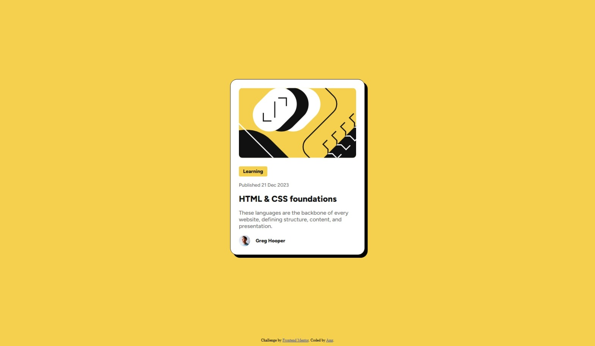

# Frontend Mentor - Blog preview card solution

This is a solution to the [Blog preview card challenge on Frontend Mentor](https://www.frontendmentor.io/challenges/blog-preview-card-ckPaj01IcS). Frontend Mentor challenges help you improve your coding skills by building realistic projects. 

## Table of contents

- [Frontend Mentor - Blog preview card solution](#frontend-mentor---blog-preview-card-solution)
  - [Table of contents](#table-of-contents)
  - [Overview](#overview)
    - [The challenge](#the-challenge)
    - [Screenshot](#screenshot)
    - [Links](#links)
  - [My process](#my-process)
    - [Built with](#built-with)
    - [What I learned](#what-i-learned)
    - [Useful resources](#useful-resources)
  - [Author](#author)

## Overview

### The challenge

Users should be able to:

- See hover and focus states for all interactive elements on the page

### Screenshot



### Links

- Solution URL: [Add solution URL here](https://your-solution-url.com)
- Live Site URL: https://amrdoe.github.io/blog-preview-card

## My process

### Built with

- Semantic HTML5 markup
- CSS custom properties
- Flexbox

### What I learned

I learned to use `box-shadow` CSS property to create drop shadow effect.

```css
.card {
  box-shadow: 8px 8px black;
}
```

I also learnt how to use custom properties to make CSS more readable and modifiable.

```js
* {
  --yellow: hsl(47, 88%, 63%);
  --gray-500: hsl(0, 0%, 42%);
  --gray-950: hsl(0, 0%, 7%);
}
```

### Useful resources

- [box-shadow - CSS | MDN](https://developer.mozilla.org/docs/Web/CSS/box-shadow) - This helped me understand and use `box-shadow` CSS property to create the card's drop shadow.
- [Variable fonts - CSS | MDN](https://developer.mozilla.org/docs/Web/CSS/CSS_fonts/Variable_fonts_guide) - This is an amazing article which helped me understand variable fonts and how to declare and use them.

## Author

- Frontend Mentor - [@amrdoe](https://www.frontendmentor.io/profile/amrdoe)
- Twitter - [@amrdoe](https://www.twitter.com/amrdoe)